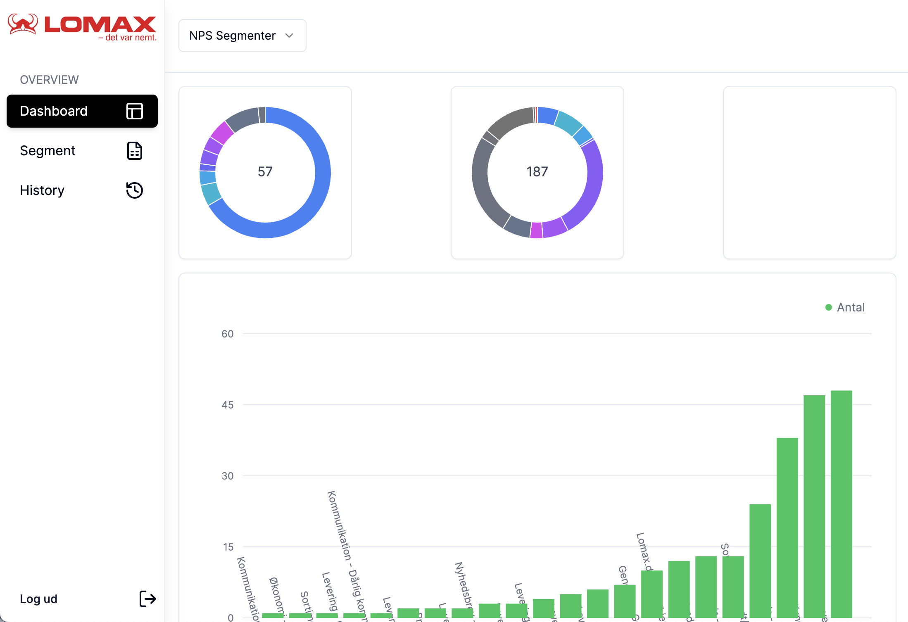

This is the repository for all of the internal AI projects at Lomax A/S.

### How to run the application

#### Node (PNPM): 
**Prerequisites**
In order to run the application, you will need `pnpm` and use node v18.17.0.

**Install dependencies**
To install the dependencies, simply type
```shell
pnpm install
```

If the prisma schema is not automatically installed, you can install it by running:
```shell
npx prisma generate
```
This will create the prisma schema in the node dependencies.

**Run**
To run the application, type:
```shell
pnpm dev
```
This will startup the application on default port 3000.


#### Docker:
Coming soon

### NPS Segmenter
